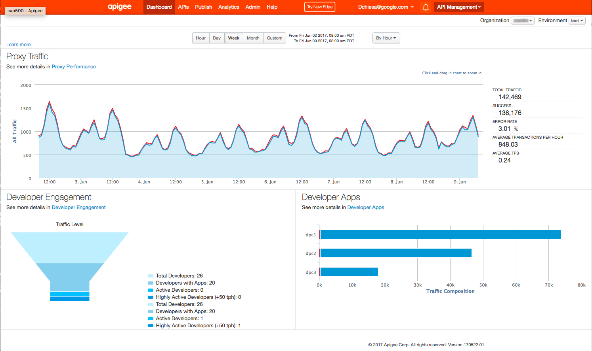

# runload-proxy


This is an Apigee Edge proxy that lets you generate and run load against a
different API. This proxy uses a nodejs target to generate outbound HTTP
requests. The "target" of these requests can be any endpoint. This proxy was
designed to generate synthetic load on API Proxies, in order to cause Apigee
Edge to collect analytics data over time.  Using that data, we can then create
analytics reports and charts based on real data.




But this proxy need not send requests to Apigee-hosted endpoints.

You can define the API endpoints to invoke, as well as the headers, query
params, and payloads to send, in a job file, which is in json format.

The tool to run the load is a nodejs script, runLoad.js. This is set as
the "target" of this API Proxy.  When you deploy this API proxy, the
load begins to run. It runs until you undeploy, or tell it to stop.
More on that later.

You can deploy this proxy to any Apigee Edge organization, either Edge SaaS or a
customer-managed (Self-managed?) Apigee Edge installation.


## License

This material is copyright 2014-2016 Apigee Corporation, 2017-2019 Google LLC.
and is licensed under the [Apache 2.0 License](LICENSE). This includes all the code as well as the API Proxy configuration.

## Pre-requisites

If you want to run the runload within an Apigee Edge proxy, then Apigee Edge is a pre-req.
You can run the runload-cli script outside of Apigee Edge, in which case you need node on your workstation, and must do an `npm install` in order to run it.


## Usage

To use as a apiproxy in Edge:

  1. in the apiproxy/resources/node directory,
     edit the model.json file to specify the job to run.

  2. packup the bundle and deploy it.  You can use the Edge UI for this
     purpose , or [importAndDeploy.js](https://github.com/DinoChiesa/apigee-edge-js/blob/master/examples/importAndDeploy.js), or your own tool.


The nodejs process runs forever. It invokes the API, maybe sleeps a little, and then
does it again. To stop it, you can send a /control action=stop request to the
proxy, about which you will read more, later in this readme.  Or, undeploy the proxy.


To use as a command-line tool:

  0. cd to  apiproxy/resources/hosted

  1. edit the config/model.json file to specify the job to run.

  2. `npm install`

  3. `npm start`


The process runs forever. It invokes the API, maybe sleeps a little, and then
does it again.  To stop it, ctrl-C.


Defining Jobs
========================

To define a job, you need to write a JSON file.  Here's a very simple example.

    {
      "name": "job1",
      "description": "Login to the Sonoa service",
      "defaultProperties": {
        "scheme": "https",
        "host": "api.sonoasystems.net",
        "port": 9001,
        "headers" : {
          "Accept" : "application/json",
          "content-type" : "application/json"
        }
      },

      "initialContext" : {
          "username":"Chris", "password":"Haljous#"
      },

      "sequences" : [{
        "description" : "login",
        "iterations" : 1,
        "requests" : [ {
          "url" : "/v1/login",
          "method" : "post",
          "payload" : {
            "username":"{{username}}",
            "password":"{{password}}"
          }
        }]
      }]
    }

In English, what this says is: the job will invoke urls on the server at
https://api.sonoasystems.net:9001. (This is a fake
endpoint, just for example purposes.) It will send HTTP headers (Accept
and content-type) that indicate the request is sending and receiving
application/json. There will be just one sequence of requests, and in
that sequence just one request. That request will POST to the url path
/v1/login . It will provide as a payload, a json object containing a
username and password. The values for the username and password are
obtained from the job context, using handlebars templates.

All the properties in the job definition .json file have case-sensitive names.

Running this job would exercise the login function of a fictitious
sonoasystems API.  The runload proxy defaults to run the job once per
minute, forever.

The initialContext property on the job provides the initial set of
context data items. In this case, the job context gets hard-coded login
credentials. These values will be accessible via handlebars "templates" that you
can apply to headers or urls or payloads on requests. In this example,
the json payload gets its values from the context. If you wanted to use a
context value to construct a url path, you could do it with a template,
this way:

    /v1/test/{{href}}

runload will replace {{href}} with the value of the href property from the
context.

The url property in the request specifies a relative or absolute URL. If
you specify a relative url which begins with a slash, then the scheme
and domain name from the "job defaults" will be prepended to the url
before it is used.  If you specify a fully qualified url, which begins
with a scheme (http or https), then the "job defaults" values are ignored
for that request.

Notes on the properties in that job description:

* **name**
  This is used in the job logging output, and also for job control
  inside Apigee Edge. The script will access the Edge cache, using a
  key name which is derived from this job name.  Therefore, use a
  unique name, a string, no spaces. (don't use 'job1')

* **description**
  Used for diagnostic purposes only. The script emits this description
  when launching the job.

* **defaultProperties**
  These are all obvious. There are no other default properties other
  than those shown in the example.


---

The payload can be a complex object, in which case the outbound message
will be implicitly sent with content-type = application/json.  Or it can
be a simple string, in which case the outbound message will be sent with
application/x-www-form-urlencoded.

Example of the former:

          "requests" : [ {
              "method" : "post",
              "url" : "/oauth/client_credentials/accesstoken",
              "headers" : {
                "accept" : "application/json",
              },
              "payload": {
                "grant_type" : "client_credentials",
                "client_id" : "{{client_id}}",
                "client_secret" : "{{client_secret}}"
              },
              ....

Example of the latter:

          "requests" : [ {
              "method" : "post",
              "url" : "/oauth/client_credentials/accesstoken",
              "headers" : {
                "accept" : "application/json",
              },
              "payload": "grant_type=client_credentials&client_id={{client_id}}&client_secret={{client_secret}}",
              ....


Using an HTTP Proxy for outbound requests
--------------------------------

Specify the proxy in a property in defaultProperties, like this:


    {
      "name": "job1",
      "description": "Login to the Sonoa service",
      "defaultProperties": {
        "proxy": "http://72.252.11.84:8080",
        "scheme": "https",
        "host": "api.sonoasystems.net",
        "port": 9001,
        "headers" : {
          "Accept" : "application/json",
          "content-type" : "application/json"
        }
      },


This should work with HTTP or HTTPS requests.


A More Complex Example
--------------------------------

Consider this job definition:

    {
      "name": "job2",
      "description": "Exercise APIs exposed by Sonoa",
      "simulateGeoDistribution": 1,
      "defaultProperties": {
        "scheme": "https",
        "host": "api.sonoasystems.net",
        "headers" : {
          "Accept" : "application/json"
        }
      },

      "initialContext" : {
        "something" : "a-value-here",
        "prop2" : "another-value"
      },

      "invocationsPerHour" : [
          44, 35, 40, 36, 27, 40, 40, 54,
          57, 62, 54, 61, 73, 70, 53, 50,
          47, 62, 74, 88, 83, 77, 70, 51
      ],

      "sequences" : [
        {
          "description" : "login",
          "iterations" : 1,
          "requests" : [ {
            "url" : "/v1/ictrl/login",
            "method" : "post",
            "headers" : {
              "content-type" : "application/json"
            },
            "payload" : {
              "username":"test",
              "password":"password"
            },
            "delayBefore" : 0,
            "extracts" : {
              "oauth_bearer_token" : "$.login.token",
              "hrefs" : "{var re1=new RegExp('^/[^/]+/[^/]+(/.*)$'), m1,m2; m1=re1.exec(obj.login.user.href); m2=re1.exec(obj.login.site.href); return {user:m1[1],site:m2[1]};}"
            }
          }]
        },
        {
          "description" : "query user item (self)",
          "iterations" : "Math.floor(Math.random() * 5) + 4",
          "delayBetweenIterations" : "Math.floor(Math.random() * 300) + 120",
          "requests" : [
            {
              "url" : "/v1/ictrl/{{hrefs.user}}",
              "method" : "get",
              "headers" : {
                "authorization" : "Bearer {{oauth_bearer_token}}"
              },
              "delayBefore" : 10
            },
            {
              "description" : "retrieve the site",
              "url" : "/v1/ictrl/{{hrefs.site}}",
              "method" : "get",
              "headers" : {
                "authorization" : "Bearer {{oauth_bearer_token}}"
              },
              "delayBefore" : 10
            }
          ]
        }
      ]
    }

This job definition adds a few properties: extracts, invocationsPerHour,
a random number of iterations, delayBetweenIterations, and geoDistribution.

* **extracts**
  After receiving the response, the script extracts data as configured in the extracts object. For each
  key in the object, there are three options:
    a string set off by double curlies is evaluated as a handlebars template
    a string set off by single curlies is eval'd as JavaScript
    otherwise, it's treated as a JSON-path and applied to the payload.

  In each case the result of the operation is placed into the job context, under
  the given name. In this example, the oauth bearer token is extracted from the
  JSON payload and then passed in the authorization header in all subsequent
  requests. You can get pretty fancy with the extracts, using them to specify
  values in the payload or the url path or headers.

* **invocationsPerHour**
  The top-level property named "invocationsPerHour" holds an array of
  24 numbers. Each number tells the load runner the number of cycles
  of the job to run for that particular hour of the day, where
  midnight begins the zero hour. These numbers don't specify the
  desired number of requests, it's the desired number of job runs,
  each of which may have multiple sequences, each of which has one or
  more requests.

    If you set this to 60 for a particular hour, runload will try to run
    60 job runs for that hour, one per minute. The runLoad script can't
    guarantee that it will run this number of jobs. For example, suppose
    one job run takes more than 60 seconds to run. If you then specify
    60 jobs per hour as a target, the script will not finish the first
    job before it needs to start the second. But the script runs the
    jobs serial fashion: the first job must complete before runload
    starts the second. So in this case, jobs will run "as fast as they
    can", but it won't reach 60 jobs per hour.

    How many invocations should you run? Hard to say. If you run 60 per
    hour, and each job implies 8 requests, then you will get 8 requests per
    minute, or about 0.13 transactions per second. Not very much. You
    can do the math yourself for your own job description.

* **simulateGeoDistribution**
  a single truthy value, which
  specifies whether the runload script should simulate geo-distributed
  load as the job runs, via the X-Forwarded-For header.  Set this
  property to zero or false in the job definition if you do not want
  geo-distributed load. If you omit the property, or set it to a
  truthy value (true, 1, or any string), you get the default behavior,
  which is an X-forwarded-for header that simulates geo distributed
  load.

* **iterations**
  This job definition also includes multiple sequences with multiple
  requests in each. The second sequence in this example shows how to
  specify a varying number of iterations. You can use any javascript
  expression that resolves to a number. For example,
  "Math.floor(Math.random() * 3) + 2". If you omit the iterations
  property, it defaults to 1.

* **delayBetweenIterations**
  A sequence consists of a set of requests, and each sequence can be
  repeated N times. Between iterations, runload may delay, this amount
  of time.  This number can be a pure numeric, interpreted as
  milliseconds to delay between iterations of a sequence, or a string
  which holds a Javascript expression that resolves to a numeric; for
  example, "Math.floor(Math.random() * 500) +
  750". delayBetweenIterations defaults to zero. This quantity is
  obviously irrelevant if the number of iterations is 1 (or default).


If you provide bad code in either of iterations or
delayBetweenIterations, the script will fail in an undefined way, so be
sure to test and verify that your logic works properly.

Also, ALL of these properties are case-sensitive. The script doesn't
flag unrecognized properties, so ... if you spell something wrong or use
the wrong case, your job definition might just "not work".  So take
appropriate care.


An Example with Imports
--------------------------------

Consider this job definition:

    {
      "name": "job1",
      "description": "Login to the Sonoa service",
      "defaultProperties": {
        "scheme": "https",
        "host": "api.sonoasystems.net",
        "headers" : {
          "Accept" : "application/json",
          "content-type" : "application/json"
        }
      },

      "initialContext" : {
        "creds" : [
          {"username":"Chris", "password":"Haljous#"},
          {"username":"Andrea", "password":"92iu2011"},
          {"username":"Jordan", "password":"ikindalikeapis@#"}
        ]
      },

      "sequences" : [{
        "description" : "login",
        "iterations" : 1,
        "requests" : [ {
          "url" : "/v1/login",
          "method" : "post",
          "imports": {
             "cred": "{{randomSelect creds}}",
          },
          "headers" : {
            "authorization" : "{{httpbasicauth cred.username cred.password}}"
          },
          "extracts" : {
            "oauth_bearer_token" : "$.login.token"
          }
        }]
      }]
    }

This one includes a new property on the request - "imports".
Each key in the object specifies a handlebars template
that gets evaluated.

Like the extracts, the imports implicitly
inject values into the context via their return values:
whatever you return from the template or function is stuffed into a named property on
the context object.

The imports run before
the call and get only the context as a parameter.
response. In contrast, the extract functions run after the call returns,
and get all the objects  in the context, plus  three additional arguments: payload (object), headers (Array of strings),
and status (int) of the most recently completed request.

Imports are useful for randomly selecting from a set
of possible values in the context. For example, for selecting from a set of credentials, or IP addresses, or etc.

In this example, the import randomly selects one of the N credentials
that are available in the initial context.


The builtin handlebars functions available in templates are:

- base64 - takes one argument and returns a base64 encoded string of that argument
- httpbasicauth - takes two arguments and returns a Basic Auth header including the "Basic " prefix.
- random - takes two numeric arguments and returns a random integer between them `{{random 5 20}}`
- randomSelect - takes one argument, an array, and selects a random item from it.
- randomString - takes one optional argument, a length, and returns a string consisting of random letters, of that length. The default length is a random value from 12 to 40.
- weightedRandomSelect - takes one argument, an array-of-array, and selects an item based on a weighted random approach using the second item of each inner array as the weight.


You can get as complex as you like with the expression. The function
gets all the context values as named parameters, so
your expression can refer to them directly.

The imports, extracts, and templating means you can create very dynamic
sequences of API requests, each of which might depend on the results of
prior requests.


Weighted Random Selection
================================

Another example:

    {
      "id" : "job1",
      "description": "drive the sayHello API in AXP test org with various keys",
      "defaultProperties": {
        "scheme": "http",
        "host": "172.31.35.53",
        "port": 9001,
        "headers" : {
          "Accept" : "application/json"
        }
      },

      "initialContext" : {
        "developerKeys" : [
          ["q1QnpiszT37QnXH5lmuftgjFH8l2KYov", 50],
          ["ZfpZ6ezXue995ZhpG0pSL5IiaSRnaiCA", 30],
          ["T1wPtPJk0MmMPzKMwm94B2Gx1wT949to", 20]
        ]
      },

      "invocationsPerHour" : [
        66, 52, 60, 54, 40, 60, 61, 81,
        88, 93, 81, 90, 103, 105, 80, 76,
        72, 93, 102, 132, 134, 108, 105, 74
      ],

      "sequences" : [
        {
          "iterations" : 1,
          "requests" : [ {
            "imports": {
              "apikey": "{{weightedRandomSelect apikeys}}",
              "ip": "{{weightedRandomSelect ips}}",
              "radius" : "{{random 20 100}}"
            },
            "headers" : { "x-forwarded-for" : "{{ip}}" }
            "url" : "/v1/dp/sayhello?arg0={{radius}}&apikey={{apikey}}",
            "method" : "get"
          }]
        }
      ]
    }

### User-Agent

To set the user-agent of requests that get sent in, you can do something like this:

```
  "requests": [
    {
      "imports": {
        "useragent": "{{weightedRandomSelect useragents}}"
      },
```

...and then use `{{useragent}}` in a header

```
      "headers" : {
        "useragents" : "{{useragent}}"
      }
```


### HTTP Basic Auth

To use http basic auth,

```
      "initialContext" : {
        "creds" : [
          {"username":"Chris", "password":"Haljous#"},
          {"username":"Andrea", "password":"92iu2011"},
          {"username":"Jordan", "password":"ikindalikeapis@#"}
        ]
      },

      "sequences" : [
        {
          "iterations" : 1,
          "requests": [ {
            "imports": {
              "cred": "{{randomSelect creds}}"
            },
            "headers" : {
              "authorization" : "{{httpbasicauth cred.username cred.password}}"
            }
            ...
```


Varying load by day-of-week
================================

Consider this example:

    {
      "id" : "job5",
      "description": "drive the EXPE test APIs",
      "defaultProperties": {
        "scheme": "http",
        "host": "localhost",
        "port": "19001",
        "headers" : {
          "Accept" : "application/json"
        }
      },

      "geoDistribution" : 1,

      "initialContext" : {
        "client_id" : "w6aWUphknyBQcwm2kCJIsfzSzNsFQPH8",
        "client_secret" : "rgypratccbL3ByDc"
      },

      "invocationsPerHour" : [
        444, 437, 340, 432, 400, 390, 400, 540,
        550, 620, 540, 600, 710, 720, 500, 480,
        480, 620, 701, 870, 830, 702, 703, 500
      ],

      "variationByDayOfWeek" : [
        0.9, 1.0, 1.1, 2.1, 1.8, 3.1, 1.1
      ],

      ....

This example adds a top-level property called variationByDayOfWeek.
This is an array of 7 co-efficients, one for each day of the week. If
this array is present, and if it has exactly 7 members, then the number
of calls to make is multiplied by the Nth member of this array, where N
is the day of the week. (0= Sunday, 1= Monday, etc.)  This allows the
load to vary over the course of the week, to make the analytics charts
look more interesting. Each coefficient should be a floating point
number between 0 and 10. If it falls out of that range, then the script
will use 1.

If you like, you can specify a hash here, using names of the days as
property names. The following is equivalent to the above  variationByDayOfWeek setting :

      "variationByDayOfWeek" : {
        "Sunday"    : 0.9,
        "Monday"    : 1.0,
        "Tuesday"   : 1.1,
        "Wednesday" : 2.1,
        "Thursday"  : 1.8,
        "Friday"    : 3.1,
        "Saturday"  : 1.1
      },


Running a request conditionally
================================

In some cases you may want to invoke an API request conditionally. The way to do this is to set the url to a template,
and set the value conditionally in an import.  Consider this request that conditionally gets a new token:

    "sequences" : [
      {
        "description" : "login",
        "iterations" : 1,
        "requests" : [ {
          "url" : "{token_url}",
          "method" : "post",
          "imports" : {
              "cred": "{{randomSelect creds}}",
              "token_url" : "{ var now = (new Date()).valueOf(); if (ctx.stamped_token && ctx.stamped_token.stamp) { var delta = now - ctx.stamped_token.stamp; if (delta<60*58*1000) { return null; } } return '/oauth/client_credential/accesstoken?grant_type=client_credentials'; }"
          },
          "headers" : {
              "authorization" : "{{httpbasicauth cred.username cred.password}}"
          },
          "delayBefore" : 0,
          "extracts" : {
              "timestamped_token" : "{ {token:payload.access_token, stamp:(new Date()).valueOf() } }"
          }
        } ]
      },

The second "import" function there, examines the context for a saved token. If one exists, and if the timestamp on it is current, then the import function returns null, which sets the named context value (token_url) to null. runload is designed to NOT run the request if the url is falsy.

If the token request IS made, then it gets stored along with the current timestamp.

The context for a subsequent run (after delay/sleep) gets the existing context, so any token that was previously acquired and its timestamp will be available.
The upshot is, the first time through this request will run and acquire a new token. On subequent runs, the request will not run.  The token will always be available as "stamped_token.token".


Running as a server
========================

This code is set up to run as a hosted target in an Apigee Edge
Proxy. It will begin running, and generating load against your targets,
as soon as you deploy your proxy.

Top stop generating load, you can undeploy the proxy.

Also, there is an API exposed by this nodejs script.

You can temporarily stop and start load like this:


    curl -X POST http://cass1-test.apigee.net/runload1/control  -d 'action=start'

    curl -X POST http://cass1-test.apigee.net/runload1/control  -d 'action=stop

And you can inquire status like this:

    curl -X GET http://cass1-test.apigee.net/runload1/status


The /status request returns information only for the MP you have
contacted. As you know, API Proxies in Apigee Edge can be deployed
across multiple MPs.

The /control endpoint affects all MPs. If you send a stop to any of
them, all instances of the script in the various MPs will stop
generating load. If you send a start to any of them, all instances of
the script in the various MPs will start generating load again.

You can deploy this API proxy in any Edge org, even in a free one, and
you can generate load on any other org. Also, in the job definition, you
specify the targets of the requests as URLs, which of course means you could
define a job that generates load on any system; the target need not be
running in Apigee Edge.

You can also control the logging level of the agent. like thi:

    curl -X POST http://cass1-test.apigee.net/runload1/control  -d 'action=setlog&loglevel=3'

These are the loglevel values:
* 0 = almost no logging
* 2 = very minimal logging - only wake/sleep and errors
* 3 = see each API call out.
* progressively more info
* 10 = max logging


